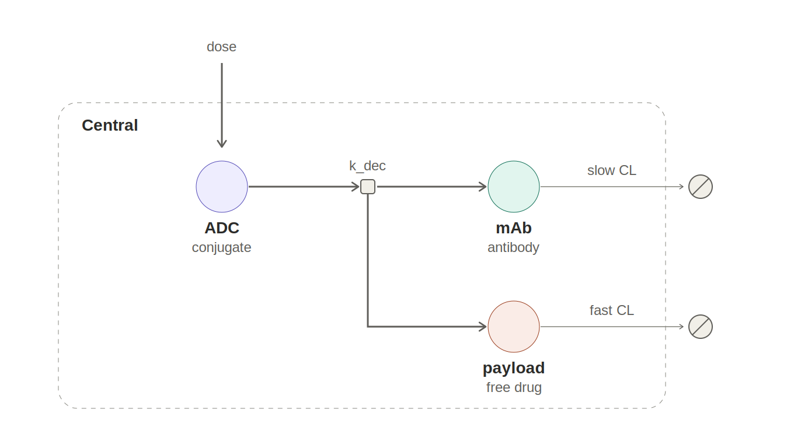
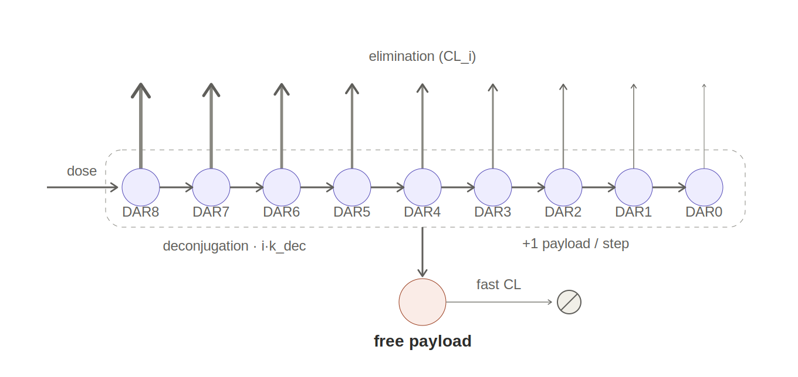
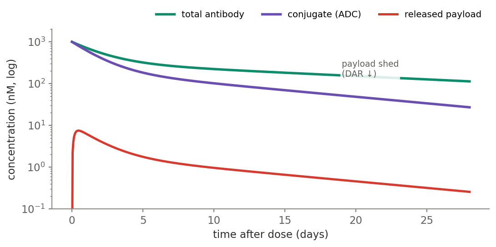
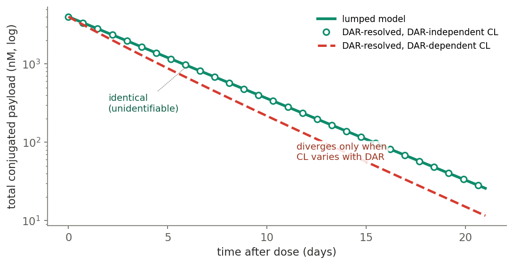
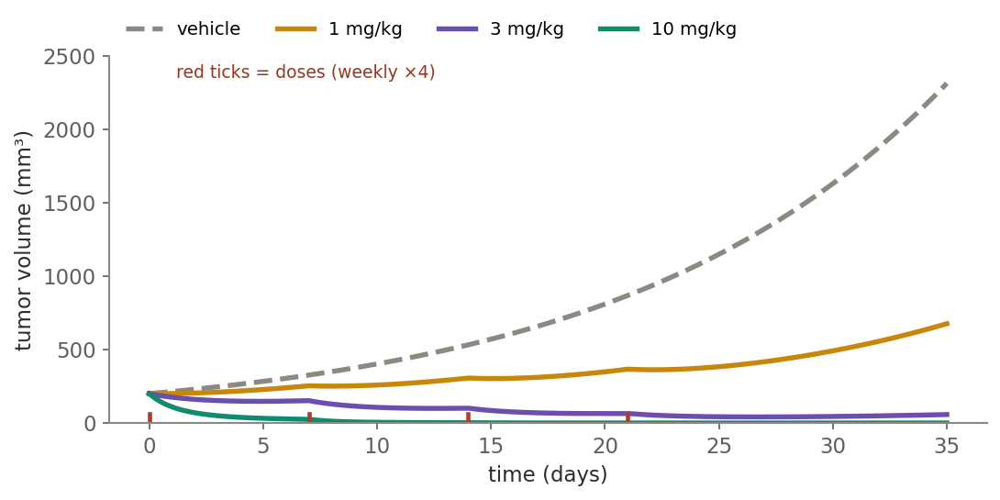
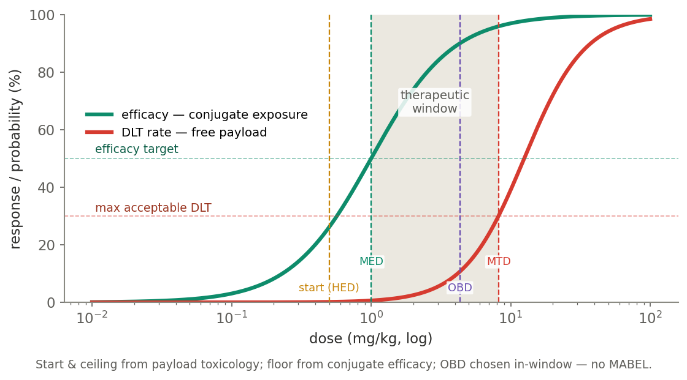
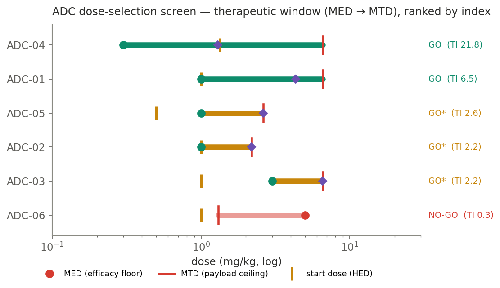

> **Disclaimer:** All datasets in this repository are simulated or 
> pseudodata generated solely for methodological demonstration purposes. 
> No proprietary, confidential, patient-derived, or employer-affiliated 
> data is included. This work represents independent research and 
> educational development conducted outside of any employment context 
> and does not reflect the proprietary methods, data, or intellectual 
> property of any employer or collaborator.
> 
> This repository is released under the [MIT License](LICENSE).
> © 2026 Bo Ma (tjmb03). Reuse with attribution.

# adc-therapeutic-index

**Multi-analyte ADC PK/PD and exposure-driven dose selection — the toxicology paradigm.**
An antibody-drug conjugate's therapeutic index is a *two-analyte* problem: efficacy is driven by
**conjugate** exposure at the tumor, dose-limiting toxicity by **free payload** systemically. This repo
implements the multi-analyte PK (lumped and DAR-resolved), a conjugate-driven tumor PK/PD, and a
dose-selection engine that places the first-in-human window and OBD from exposure–response — the way you
do it for a *cytotoxic* ADC, which is toxicology-anchored, **not** MABEL.

Companion to [`bispecific-fih-dosability`](https://github.com/tjmb03/bispecific-fih-dosability): the same
*use-mechanism-to-select-molecules* theme, and the explicit contrast in FIH logic — **MABEL / occupancy
for an immune agonist, toxicology / NOAEL for a cytotoxic ADC.**

---

## The problem

ADC PK is never one curve. At least three species move together, and you need all three because efficacy
and safety live on different ones:

- **conjugate** — antibody still carrying ≥1 payload; delivers payload to the tumor → **efficacy**;
- **total antibody** — conjugated + fully deconjugated; the long-lived backbone;
- **released payload** — free cytotoxin on its own fast clearance → **dose-limiting toxicity**.

<p align="center">

&nbsp;&nbsp;

</p>

Deconjugation sheds payload, so the average DAR falls and the conjugate curve pulls away from total
antibody; the released payload is a low, formation-rate-limited peak that trails the conjugate:

<p align="center"></p>

## Lumped vs DAR-resolved — an identifiability result

You can model the conjugate as one pool with an average DAR (**lumped**) or resolve the full
DAR0…DAR_max cascade (**DAR-resolved**). Which should you fit? The model settles it
([`pk.py`](src/adcti/pk.py), pinned in [the tests](tests/test_pk.py)):

> Under **DAR-independent clearance**, the total conjugated-payload PK of the DAR-resolved model is
> **identical** to the lumped model's `conjugate × DAR` — both decay as `exp(-(ke + k_deconj)·t)` and the
> average DAR falls as `DAR0·exp(-k_deconj·t)`. The two **diverge only when clearance varies with DAR.**

<p align="center"></p>

So the DAR-resolved model is only *identifiable* with DAR-distribution data (or demonstrably
DAR-dependent clearance). Absent that, the extra compartments are unsupported and the lumped model is the
honest choice — a modeling-vs-bioanalytics decision, not a matter of taste. (In the repo: agreement to
~1e-8 under DAR-independent CL; ~9% divergence once clearance rises with DAR.)

## PK/PD — conjugate drives the tumor

Conjugate exposure drives a tumor-growth-inhibition model ([`pd.py`](src/adcti/pd.py)). The teaching point
is the low-dose *regrowth between doses*: schedule, not just cumulative dose, matters — so you model the
time course, not a single AUC.

<p align="center"></p>

## Dose selection — the toxicology paradigm

For a cytotoxic ADC the DLT is off-target free payload, so the FIH window is built from exposure–response,
not occupancy ([`doseselect.py`](src/adcti/doseselect.py)):

- **start dose** — toxicology-anchored: an animal HNSTD (or STD10) → human-equivalent dose ÷ a safety
  factor (default 6; ICH S9 HNSTD approach);
- **floor (MED)** — the **conjugate** exposure–response (minimum efficacious dose);
- **ceiling (MTD)** — the **free-payload** exposure–response (maximum tolerated dose);
- **OBD / RP2D** — chosen *inside* the window by exposure–response (Project Optimus), not at the MTD.

<p align="center"></p>

Conjugate target occupancy sits on the **efficacy** side — it sets the active dose, not the start dose.
(On-target/off-tumor binding — e.g. CEACAM5 on normal GI — is the one place conjugate occupancy re-enters
as a *safety* input; out of scope here.) This is the mirror image of the bispecific's occupancy corridor,
where engagement itself is the hazard and MABEL governs.

## Results — screening a candidate panel

Six ADCs ([`data/adc_candidates.csv`](data/adc_candidates.csv)), each perturbing one lever, scored for
window and OBD and ranked by therapeutic index ([`examples/dose_selection.py`](examples/dose_selection.py)):

<p align="center"></p>

| ADC | ED50 / f_payload / TD50 | MED | MTD | OBD | TI | verdict |
|-----|-------------------------|----:|----:|----:|---:|---------|
| **ADC-04** | 0.3 / 0.05 / 0.5 | 0.30 | 6.55 | 1.30 | **21.8** | GO — high antigen + potent ⇒ widest index |
| **ADC-01** | 1.0 / 0.05 / 0.5 | 1.00 | 6.55 | 4.33 | **6.5** | GO — baseline, OBD below MTD |
| **ADC-05** | 1.0 / 0.05 / **0.2** | 1.00 | 2.62 | 2.62 | **2.6** | GO\* — toxic payload, tox-limited (OBD = MTD) |
| **ADC-02** | 1.0 / **0.15** / 0.5 | 1.00 | 2.18 | 2.18 | **2.2** | GO\* — unstable linker drops the ceiling |
| **ADC-03** | **3.0** / 0.05 / 0.5 | 3.00 | 6.55 | 6.55 | **2.2** | GO\* — low potency raises the floor |
| **ADC-06** | 5.0 / 0.15 / 0.3 | 5.00 | 1.31 | — | **0.26** | **NO-GO** — MED above MTD, no window |

Three mechanistic reads the screen makes explicit:

- **ADC-01 vs ADC-02** — identical but for linker stability (`f_payload` 0.05 → 0.15). More free payload per
  dose drops the MTD 6.55 → 2.18 and the index 6.5 → 2.2. **Linker stability is a therapeutic-index lever,
  through the payload ceiling.**
- **ADC-01 vs ADC-03** — lower potency / antigen (ED50 1 → 3) raises the **MED**, shrinking the window from
  the floor while the ceiling is unchanged.
- **ADC-05** — a more toxic payload (TD50 0.5 → 0.2) drops the MTD so the window is tox-limited: the OBD is
  pinned *at* the MTD, you cannot reach the efficacy plateau safely. **ADC-06** stacks low potency and an
  unstable linker until the floor rises above the ceiling — no window at all.

## Reproduce

```bash
pip install -e .            # or: pip install -e ".[dev]" for the tests
python -m pytest -q         # 13 tests: multi-analyte PK, the identifiability result, the decision rule
python -m adcti.figures     # regenerate every figure in figures/ from the model
python examples/multianalyte_pk.py   # PK summary + the lumped-vs-DAR identifiability check
python examples/dose_selection.py    # the ranked panel + rebuild adc_panel.png
```

Programmatic use:

```python
from adcti import select_dose

r = select_dose("my-adc", ED50=1.0, f_payload=0.05, TD50=0.5, hnstd_hed=6.0)
print(r.dosable, round(r.therapeutic_index, 1), r.verdict)
# True 6.5 GO: wide therapeutic index
```

## Caveats (illustrative model, not fitted)

- **First-order compartmental PK; single average-DAR release.** A full model would add DAR-resolved
  clearance from data, tumor disposition, and payload distribution kinetics.
- **Dose-selection uses the exposure–response reduction** (efficacy ∝ conjugate/dose, DLT ∝ free-payload
  exposure = `dose × f_payload`); the multi-analyte ODE PK is the mechanism behind that reduction, shown
  separately.
- **Toxicology thresholds are placeholders.** The HNSTD, safety factor, efficacy target, and DLT rate
  stand in for a program-specific analysis, not regulatory values.
- **Soluble-target sink not included.** For a shed antigen (CEACAM5 → serum CEA), a soluble-target TMDD
  term buffers the conjugate and belongs in the PK — a natural extension, omitted here for clarity.
- **Parameters are representative, not measured.** The panel is synthetic and exists to exercise the levers
  (potency/antigen, linker stability, payload toxicity).

## Layout

```
src/adcti/
  pk.py           # multi-analyte PK: lumped + DAR-resolved; the identifiability result
  pd.py           # conjugate-driven tumor growth inhibition
  doseselect.py   # exposure-response window (HED start, MED, MTD, OBD) + panel screen
  figures.py      # regenerates all figures from the model
data/adc_candidates.csv
examples/          # multianalyte_pk.py, dose_selection.py
figures/           # generated figures + the two ADC schematics
tests/             # PK behaviour, the identifiability result, the decision rule
```

## License

MIT © 2026 Bo Ma
